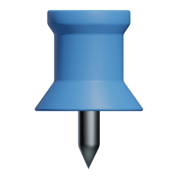
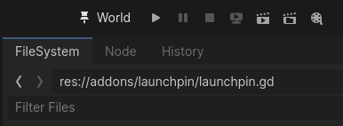

**Launchpin** is a small Godot plugin that keeps a pinned scene or the last run scene in the run bar, for easy access.

> [!NOTE]
> Requires Godot 4.4.

## Installation

1. Download latest release from [here](https://github.com/vaner-org/launchpin/releases/latest) or [AssetLib](https://godotengine.org/asset-library/asset/4083) and place it in your project's `addons` folder.
2. In the toolbar, navigate to Project > Project Settings > Plugins and enable Launchpin. 
3. If you also have [Launchpad](https://github.com/vaner-org/launchpad) installed, it will prefer this scene.
## Usage

* Run any scene to track history.
* Right-click: pin the currently open scene. Again to unpin.
* Left-click: run scene.
* Middle-click: set scene as the project's main scene.
* Shift + Left-click: set scene as the project's main scene.
* Shift + Right-click: pin the currently open scene and set it as the project's main scene.
## License

Available [here](LICENSE.txt).
## Donation

[<picture><source media="(prefers-color-scheme: dark)" srcset="img/kofi-dark.svg"></picture>](https://ko-fi.com/E1E8K9QWD)
